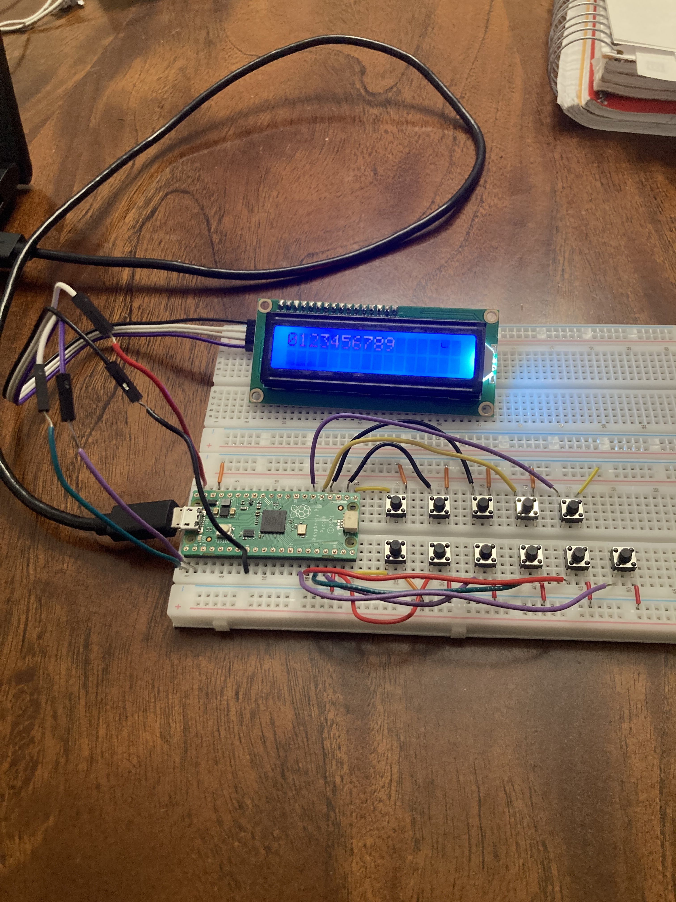
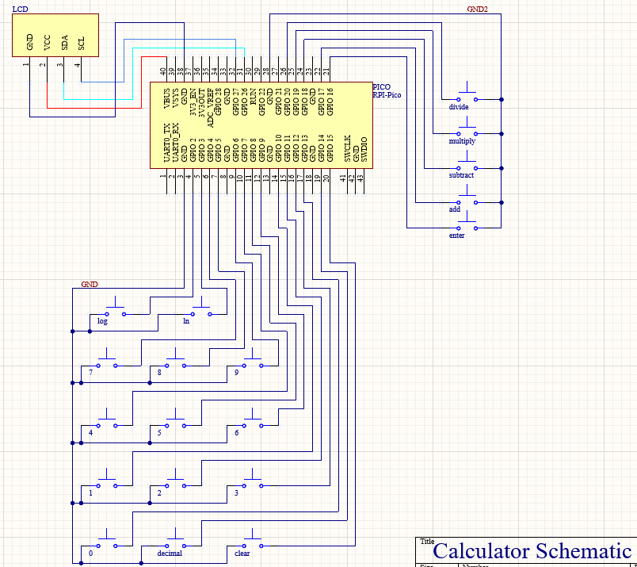
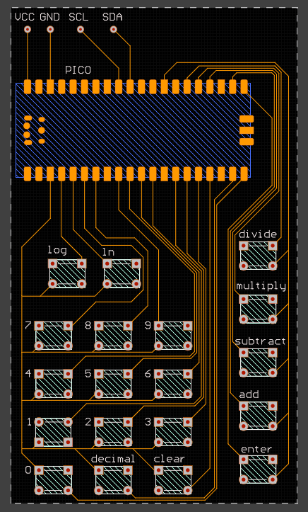
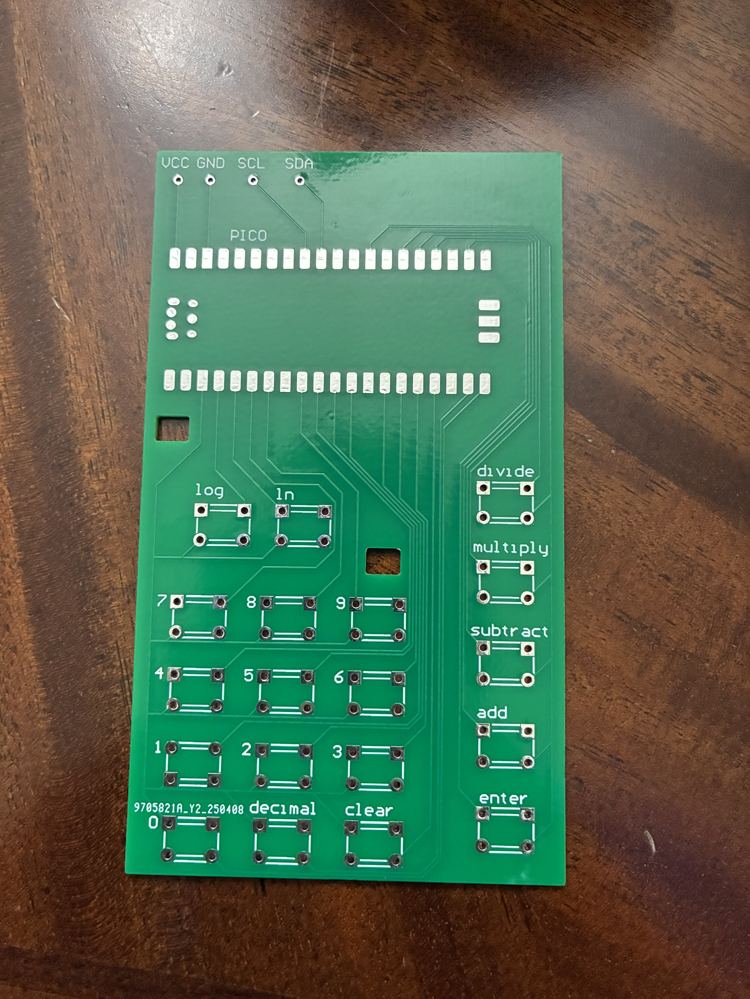
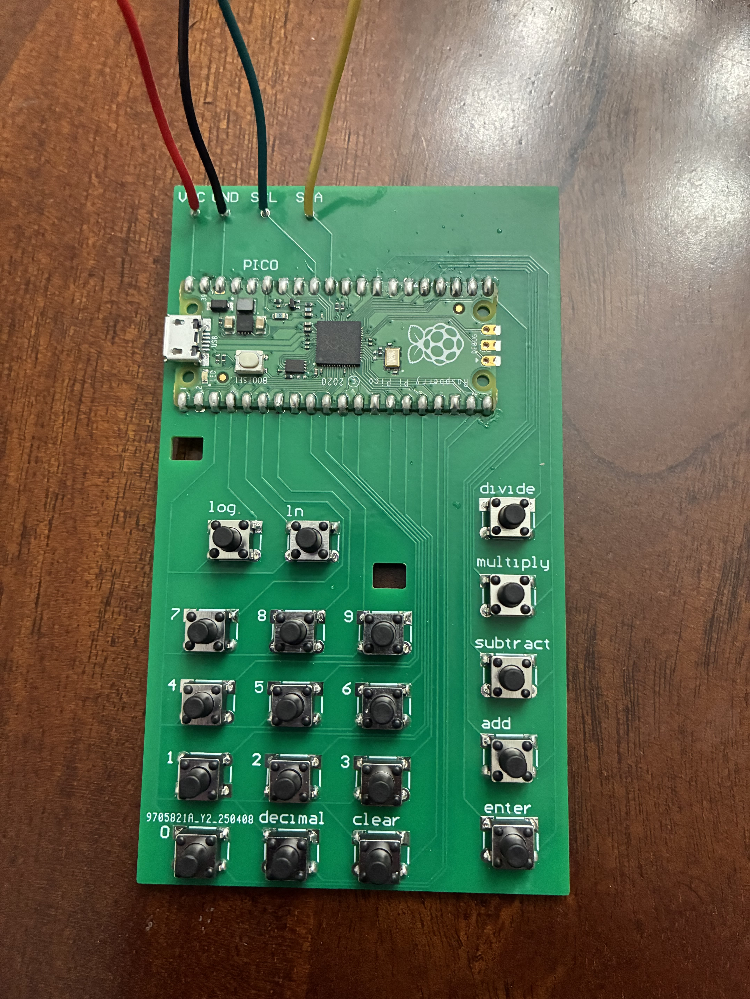
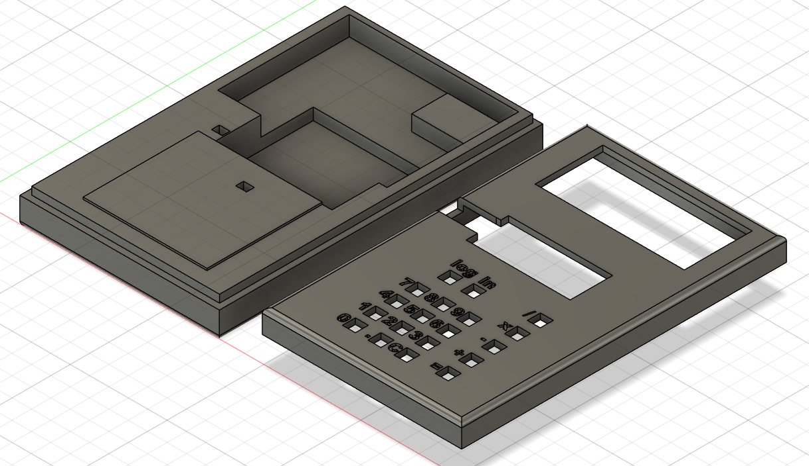
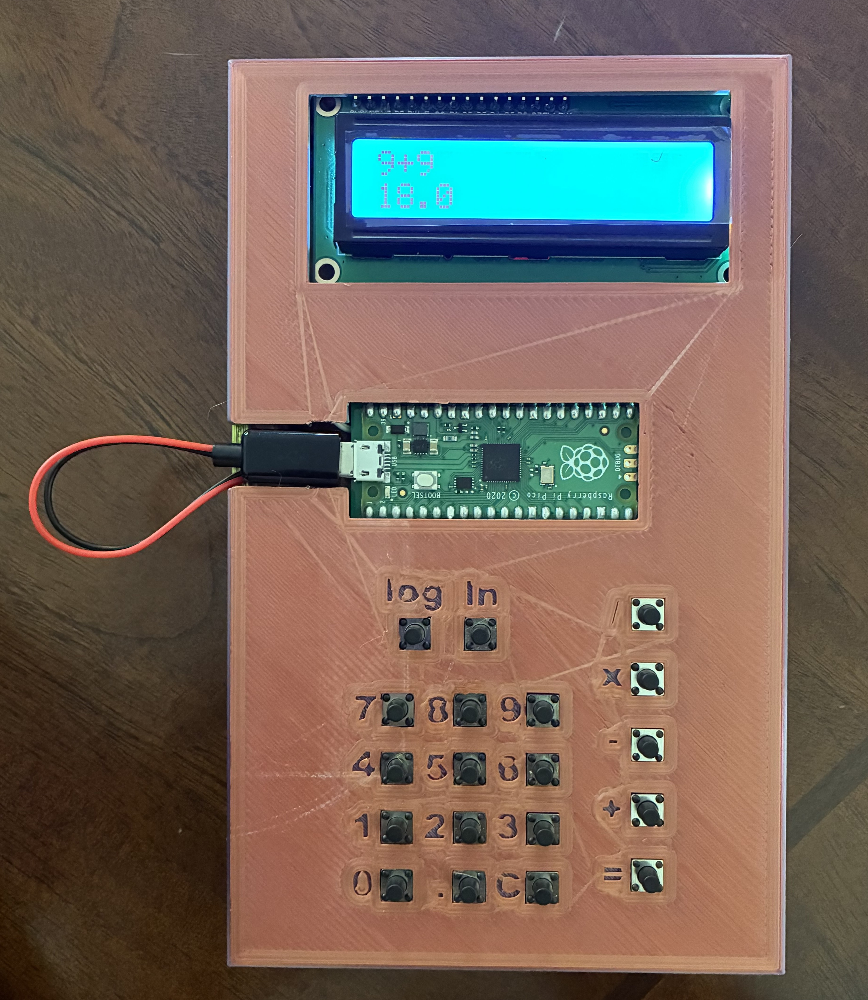

# CalcBuild
I wanted to learn how to solder and design PCBs for some time and creating this calculator was a great opportunity to do so while also working on my CAD skills. This repository is here to have all my files and some pictures all in one place for easy access.

### Early Circuit Design
This is a numberpad I set up on a breadboard to test my code throughout the whole process of making the calculator. LCD uses the I2C protocol, I used libraries from a different github user to get it working properly.

 
### Schematic and PCB Design
After setting up the numberpad I got the general idea of how to set up the circuit so made a schematic.

Final design of the PCB. Both the schematic and PCB were designed in Altium CircutMaker.

### Finished PCB

### Case Model and Final Product
I directly exported the PCB and components from Altium into Fusion 360 to design the case.

The calculator is powered by a AA battery pack behind the PCB that plugs into the Raspberry Pi Pico.

Really enjoyed working on this project! In the future I might try using a different microcontroller to reduce the size of the PCB and case since the battery pack is why the case is so thick. CAD, PCB and code files can be found above (code isnt the best but it gets the job done).
